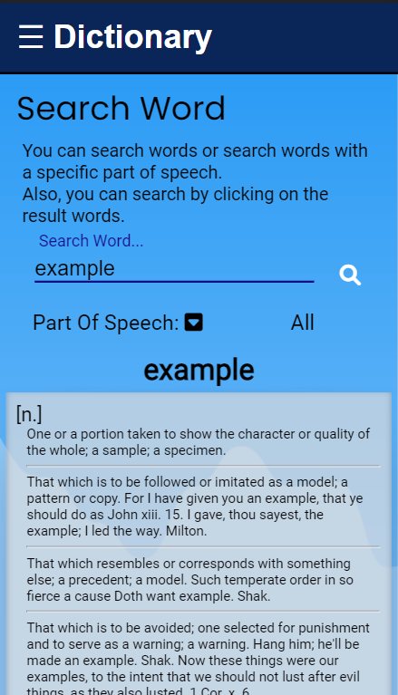
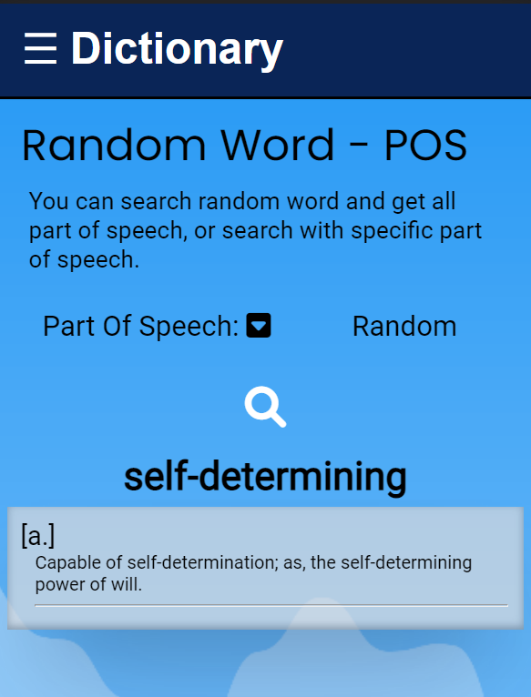

# Full-Stack-Dictionary 📚

---

## Technologies in use 💻 -

### Back 🔙 :

- #### Node.js
- #### Serverless
- #### AWS ☁ - DynamoDB

#### Packages 📦 - Express, Aws-sdk, Serverless-http , Serverless-offline, Dotenv, Cors, Nodemon, Jest, Supertest.

### Front ⏩ :

- #### React

- #### TypeScript

- #### AWS ☁ - S3 simple storage service

#### Packages 📦 - Axios, Nanoid, React-router-dom ,Sass, Cypress.

---

## My App 📖 -

## Back & Front repo -

**_Work separately on 2 different repositories then connect them and continue working_**

### <u>_Back Repo_</u> - https://github.com/yakovcohen4/AWS-Dictionary-Back

### <u>_Front Repo_</u> - https://github.com/yakovcohen4/AWS-Dictionary-Front

## Global use - 🌎

### Test The App - 🔗 [Yakov's Dictionary](http://dictionary-yakov2.s3-website-eu-west-1.amazonaws.com/)

- **The Front was served in S3 bucket as a static file.**

### Test The Server 💯- [My server to get JSON answers](https://moj90vlvy0.execute-api.eu-west-1.amazonaws.com/dev)

- ** 1. DynamoDB to store data.  2. Serve the app by REST API (Api Gateway) in conjunction with Lambda serverless function.**

#### _If the server is blocked, it's because you will not waste my money_ 💸 ⛔

## Local use - 📌

### Github 🐱‍👤

- **Clone this repo**
- **Run `npm i` on the `Back` and `Front` dirs - To install all the dependencies**

#### To seed the DB -

- **Download the AWS CLI and configure your details**
- **Create a table on dynamoDB and switch the `TABLE_NAME` in `back/utils/constants`**
- **Choose your `REGION` in `back/utils/constants`**
- **Create `.env` file and save - ACCESS_KEY_ID=?, SECRET_ACCESS_KEY=?**
- **Run `node /back/index` to start seeding your table (This may take some time)**

#### To upload the backend as lambda

- **[Download serverless](https://www.serverless.com/framework/docs/getting-started)**
- **Run `serverless deploy` on `back` dir.**

#### To run the app

- **Back -  run `npm run dev` on `back` dir  _OR_ 
  run `serverless offline` on the `cmd cli` (PORT=3000)**
- **Front -   Check that `BASE_URL` on `front/src/app` is `http://localhost:3000`  Run `npm start` on `front` dir (PORT=3006)**

### Features 😱💥 -

- Over 100,000 words!
- Search by word and get all its definitions in the different parts of speech.
- Search by word and part of speech desired.
- Receiving a random word and get all its definitions in the different parts of speech.
- Receiving a random word in a particular part of speech.
- By clicking each word in the result words, your search for the clicked word!
- Mobile first design!
- Awesome loader.

### To Do ⛳-

#### Back 🔙 :

- More Unit test.

#### Front ⏩ :

- A Footer.

---

## Screenshots 💻 -

## **_Back JSON results_** :

### Routes:

### `BASE_URL/item`:

**For the result of a word search - all parts of speech**

### 

### `BASE_URL/item/n.` :

**For a result of a word search - in a specific parts of speech**

### 

### `BASE_URL/part-of-speech/v.` :

**Receiving a random word in a specific parts of speech**

### 

### `BASE_URL/part-of-speech/verbs?letter=b` result:

### 

## **_Front :_**

### Dynamic Routers :

- **`"BASE_URL/"` - For home page**

- **`"BASE_URL/word/:word"` - For the result of a word search - All Parts Of Speech**

- **`"BASE_URL/part-of-speech/:part"` - Receiving a random word in a specific parts of speech**

---

## Assignment -

Your about to build an english dictionary app

1. Download English Dictionary in CSV format.
2. Set up a DynamoDB with `dictionary` table.
3. DATABASE: Parse & Insert all words, in a common structure, to `dictionary` table.
4. BACKEND: Build a REST API with the following end point(s):

   1. `GET /:word` - if word has more than one parts of speech will return all words part of speech, else, will return a word + definition + part of speech.
   2. `GET /:word/:partOfSpeech` - will return a word + definition + part of speech (n, v, adj).
   3. `GET /part-of-speech/:part` - for example, `/part-of-speech/adjective`, will return a random word + definition + part of speech (`part` is enum).
   4. `GET /part-of-speech/:part?letter=X` - for example, `/part-of-speech/noun?letter=m`, will return a random word with the same letter + definition + part of speech.

   `BONUS: should be deployed as 'lambda function'`

5. FRONTEND: build a create-react-app English dictionary app (mobile first)
   URL routes:

   1. `/:word` - dynamic route - word is dynamic URL parameter, used to request backend api.
   2. `/:word/:partOfSpeech` - dynamic route - word is dynamic URL parameter, used to request backend api.
   3. `/:word/part-of-speech/:part` - part is enum URL parameter, used to request backend api.

   each word in dictionary is clickable and will redirect to a common URL

   `BONUS: should be deployed to S3 bucket`
