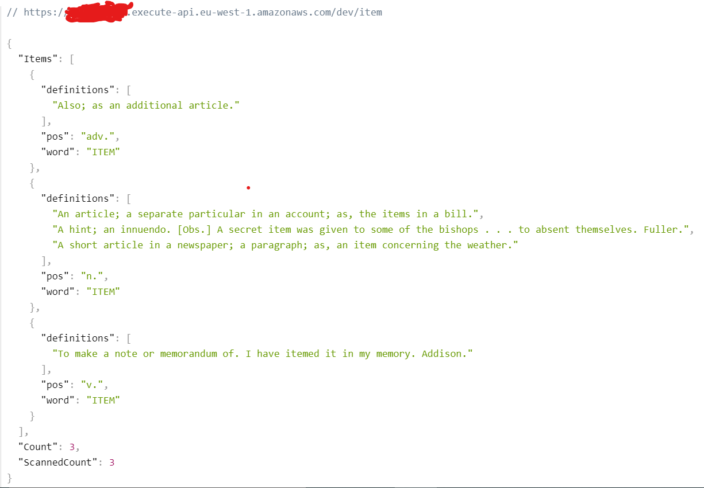

# English-Dictionary-AWS - My backend

---

## Technologies in use 💻 -

- #### Node.js
- #### Serverless
- #### AWS - DynamoDB

#### Packages 📦 - express, aws-sdk, serverless-http , serverless-offline, dotenv, cors, nodemon.

---

## My app 📖-

### [🔗 Front-side](https://github.com/yakovcohen4/AWS-Dictionary-Front)

### Server-side 💻-

- **A server built using the expressJS directory.**
- **Served with the serverless-http package as a Lambda function.**
- **The lambda function invoke by the Api-Gateway service.**
- **All configuration of the aws services was done with the help of the serverless framework.**

### Features -

- **Over 30,000 words!**
- **Search by word and get all its definitions in the different parts of speech.**
- **Search by word and part of speech desired.**
- **Receiving a random word in a particular part of speech.**
- **Receive a random word in a particular part of speech that contains a letter or letter combination of your choice.**

### TO DO -

- **ErrorHandler to server**

---

## Test The Server 💯-

### [My server to get JSON answers](https://moj90vlvy0.execute-api.eu-west-1.amazonaws.com/dev)

- **The backend works with -  1. DynamoDB to store data.  2. The app by REST API (API Gateway).**

---

## Screenshots -

## Back JSON results:

### Routes:

### `BASE_URL/item`:

**For the result of a word search - all parts of speech**

### 

### `BASE_URL/item/n.` :

**For a result of a word search - in a specific parts of speech**

### 

### `BASE_URL/part-of-speech/v.` :

**Receiving a random word in a specific parts of speech**

### 

### `BASE_URL/part-of-speech/verbs?letter=b` result:

### 

---

## Assignment - backend

Your about to build an english dictionary app

1. Download [English Dictionary in CSV format](https://www.bragitoff.com/2016/03/english-dictionary-in-csv-format/)
2. [x] Set up a DynamoDB with `dictionary` table
3. [x] **DATABASE:**
   1. [x] Parse & Insert all words, in a common structure, to `dictionary` table
4. [x] **BACKEND:**
   1. build a REST API with the following end point(s):
      1. [x] `GET /:word` - if word has more than one parts of speech will return all words part of speech, else, will return a word + definition + part of speech.
      2. [x] `GET /:word/:partOfSpeech` - will return a word + definition + part of speech [(noun, verb, adjectives, etc...)](https://www.dictionary.com/e/parts-of-speech/)
      3. [x] `GET /part-of-speech/:part` - for example, `/part-of-speech/adjective`, will return a random word + definition + part of speech (`part` is enum)
      4. [x] `GET /part-of-speech/:part?letter=X` - for example, `/part-of-speech/noun?letter=m`, will return a random word with the same letter + definition + part of speech
   2. [x] **BONUS**: should be deployed as `lambda function`
