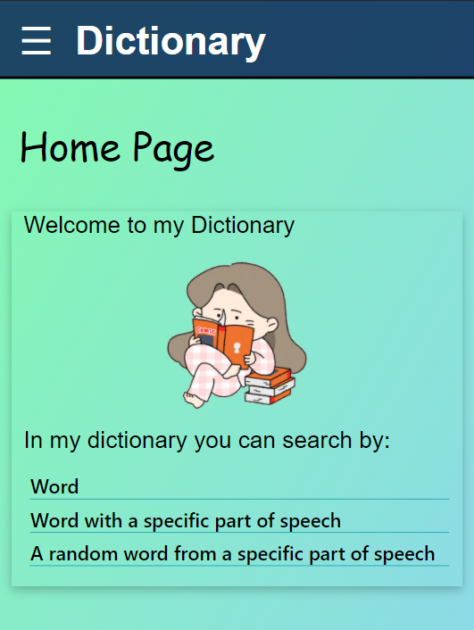
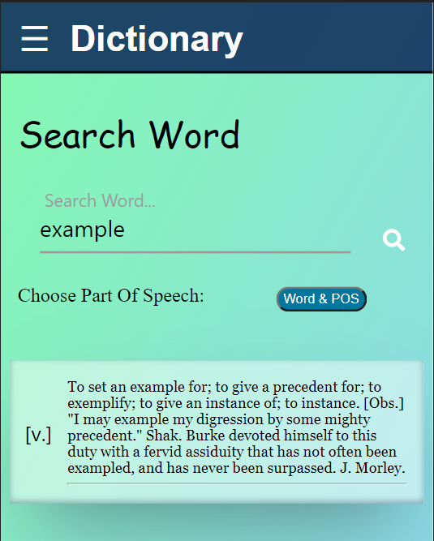
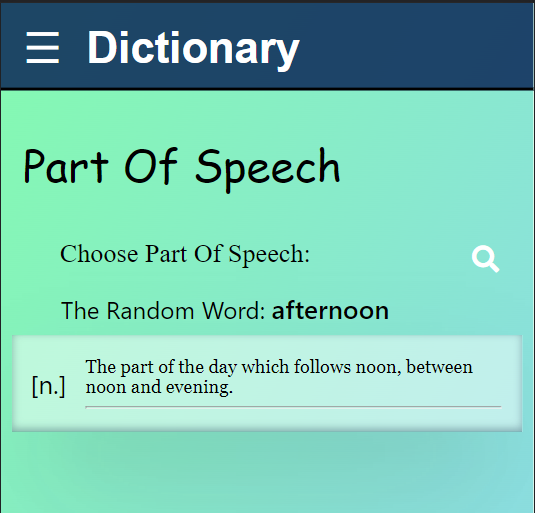

# English-Dictionary-AWS - My frontend

---

## Technologies in use 💻 -

- #### React

- #### TypeScript

- #### AWS - S3 simple storage service

#### Packages 📦 - axios, nanoid, react-router-dom ,sass

---

## My App 📖 -

## 🔗 [Yakov's Dictionary](http://dictionary-yakov2.s3-website-eu-west-1.amazonaws.com/)

### Features -

- Over 30,000 words!
- Search by word and get all its definitions in the different parts of speech.
- Search by word and part of speech desired.
- Receiving a random word in a particular part of speech.
- By clicking on any of the words you can switch to the definition of the same word!
- Mobile first design!
- Nice loader.

### To Do -

- Error handling to fail request.

---

## Screenshots -

### Dynamic routes:

- **`"BASE_URL/"` - For home page**

- **`"BASE_URL/word/:word"` - For the result of a word search - All Parts Of Speech**

- **`"BASE_URL/part-of-speech/:part"` - Receiving a random word in a specific parts of speech**

---

## Assignment - Front

Your about to build an english dictionary app

1. [x] **FRONTEND:**
   1. [x] build a `create-react-app` english dictionary app (mobile first)
   2. [x] URL routes:
      1. [x] `/:word` - dynamic route - `word` is dynamic URL parameter, used to request backend api
      1. [x] `/:word/:partOfSpeech` - dynamic route - `word` is dynamic URL parameter, used to request backend api
      1. [x] `/part-of-speech/:part` - `part` is enum URL parameter, used to request backend api
   3. [x] each word in dictionary is clickable and will redirect to a common URL
   4. [x] **BONUS** should be deployed to `S3 bucket`
